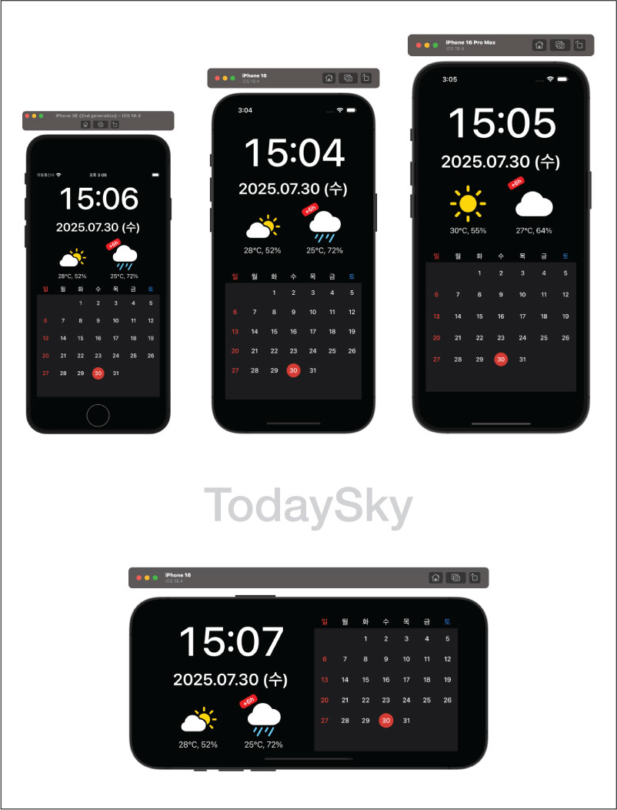

# TodaySky

> **Author:** DONGKOOK YANG ([@dk7998](https://github.com/dk7998))  
> **Project:** TodaySky (iOS Swift App)  
> **Last Update:** 2025.07

---

## 📱 App Screenshots

<p align="center">
  
</p>

---

## 📱 About

**TodaySky**는 실시간 **날씨 정보**와 **공휴일 캘린더**를  
한눈에 보여주는 iOS 위젯/캘린더 앱입니다.

- **RESTful Open API**(공공 데이터포털, 기상청 API) 연동 예제로,  
  외부 API 사용/파싱/에러처리/자동 갱신 구조를 보여주기 위해 작성되었습니다.
- **오직 Swift 코드 기반**으로 작성되었으며,  
  **Storyboard, XIB, nib, 이미지, 리소스 파일을 전혀 사용하지 않습니다.**
- 핵심 구조, MVVM+Delegate 아키텍처, API 연동, 커스텀 뷰 등  
  **직접 작성한 코드**만으로 구성되어 있습니다.
- **AppDelegate.swift, SceneDelegate.swift, Info.plist 등**  
  Xcode 기본 생성 파일, 빌드/환경설정/자원 파일은 **보안 및 불필요 파일 정리를 위해 저장소에 포함하지 않습니다.**
  - Info.plist의 경우 API 키 등 민감 정보 보호를 위해 미공개 처리(프로젝트 실행 전 직접 입력 필요).
- **가로/세로(Orientation) 모드** 모두 지원,  
  다양한 iPhone 기기에서 **자동 레이아웃**으로 최적화된 UI 제공

> **실무 및 코드리뷰, 채용 과제에 적합한 “코드만” 공유용 RESTful API 예제입니다.**  
> 실제 앱 동작/빌드를 위해서는 프로젝트 기본 파일 및 리소스는 별도 준비 바랍니다.

---
```
## 🏗️ 프로젝트 폴더/파일 구조
TodaySky/
│
├── Model/
│   └── CalendarManager.swift
│
├── Network/
│   └── NetworkMonitor.swift
│
├── ViewModel/
│   ├── HolidayViewModel.swift
│   ├── ScreenSizeViewModel.swift
│   └── WeatherViewModel.swift
│
├── Views/
│   ├── CalendarDateCell.swift
│   ├── CalendarView.swift
│   ├── PaddingLabel.swift
│   └── ViewController.swift
│
└── TodaySkyTests/
    ├── HolidayViewModelTests.swift
    └── WeatherViewModelTests.swift
```
---

## 🔑 주요 구조 및 역할

- **Model/**
  - `CalendarManager.swift`: 캘린더/날짜 관리 헬퍼

- **Network/**
  - `NetworkMonitor.swift`: 네트워크 연결 상태 감지/노티

- **ViewModel/**
  - `HolidayViewModel.swift`: 공휴일 API 연동/캐싱
  - `WeatherViewModel.swift`: 기상청 날씨 API 연동/파싱
  - `ScreenSizeViewModel.swift`: 화면/폰트/아이콘 사이즈 동적 계산

- **Views/**
  - `CalendarDateCell.swift`: 달력 셀(오늘/선택 상태 표시)
  - `CalendarView.swift`: 커스텀 달력
  - `PaddingLabel.swift`: 인셋 조절 UILabel
  - `ViewController.swift`: 메인 UI(시계/달력/날씨) 관리

- **TodaySkyTests/**
  - `HolidayViewModelTests.swift`, `WeatherViewModelTests.swift` 등  
    각 ViewModel별 단위 테스트/로직 검증 예시 포함

---

## ⚙️ 기술 스택

- **Language:** Swift 5.8+
- **Framework:** UIKit, Foundation, Network
- **Architecture:** MVVM + Delegate
- **Target:** iOS 15.0+
- **API:**  
  - 기상청 단기예보 OpenAPI  
  - 공공데이터포털 공휴일 OpenAPI
- **UI:** 오토레이아웃, 다크모드, 소형기기 대응

---

## 🚀 실행/빌드 방법

1. **Xcode 14 이상에서 열기**
2. Info.plist에 API 키 등록  
   - `WeatherServiceKey`, `HolidayServiceKey` 항목 필요
3. 시뮬레이터 또는 실기기(iOS 15+)에서 Build & Run

---

## 🗂️ 파일/폴더 선택 기준

> 불필요한 리소스/스토리보드/테스트코드는 gitignore 처리.  
> **직접 작성한 Swift 소스만 정리해 공유합니다.**

---

## ℹ️ 기타

- **문의:** [GitHub 프로필](https://github.com/dk7998) 또는 Issue 등록
- **저작권:** 본 프로젝트 코드는 DONGKOOK YANG(양동국)에게 있으며,  
  무단 복제 및 상업적 사용을 금지합니다.

---
